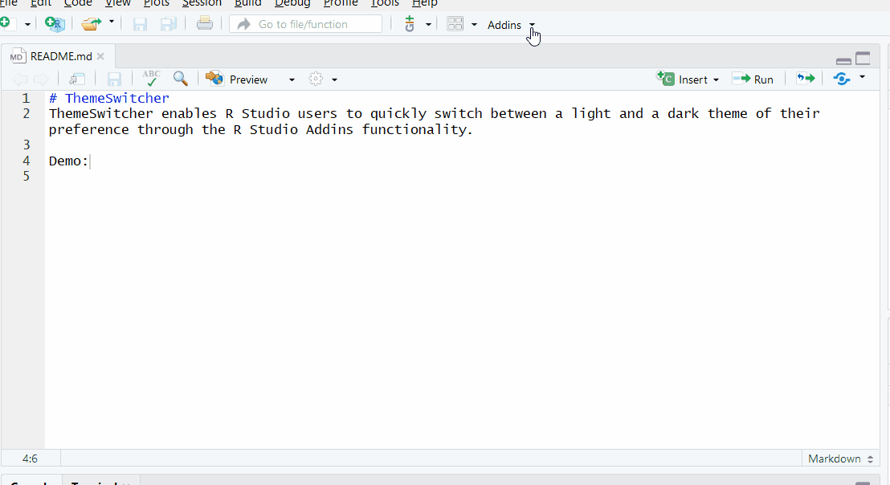

[](https://travis-ci.org/bkam235/ThemeSwitcher)

# ThemeSwitcher
ThemeSwitcher enables R Studio users to quickly switch between a light and a dark theme of their preference through the [R Studio addins](https://rstudio.github.io/rstudioaddins/) functionality.

Demo:


Once the ThemeSwitcher package is installed, functionality is added automatically to the R Studio addins dropdown. No need to include `library(ThemeSwitcher)` in your R scripts. 

## Installation
```
# install.packages("devtools")
devtools::install_github("bkam235/ThemeSwitcher")
```

## Setting theme preferences
ThemeSwitcher provides 2 function to set custom theme preferences:

* `set_light_theme(theme = "TextMate")`: sets the light theme that the addin function "Light Theme" applies. Default is "TextMate" (R Studio default theme).
* `set_dark_theme(theme = "Material")`: sets the light theme that the addin function "Dark Theme" applies. Default is "Material".

Both functions expect valid theme name as theme parameter. Valid theme names and their appearance can be found in R Studio under Tools/Global Options/Appearance/Editor Themes.

## Valid theme names
As of R Studio 1.1.383, valid theme names are:

* Ambiance 
* Chaos
* Chrome
* Clouds Midnight
* Clouds
* Cobalt
* Crimson Editor
* Dawn
* Dracula
* Dreamweaver
* Eclipse
* Idle Fingers
* Katzenmilch
* Kr Theme
* Material
* Merbivore Soft
* Merbivore
* Mono Industrial
* Monokai
* Pastel on Dark
* Solarized Dark
* Solarized Light
* TextMate
* Tomorrow Night Blue
* Tomorrow Night Bright
* Tomorrow Night 80

## Requirements
R Studio >= 0.99.878 (addins support)
